# serverless-fastapi

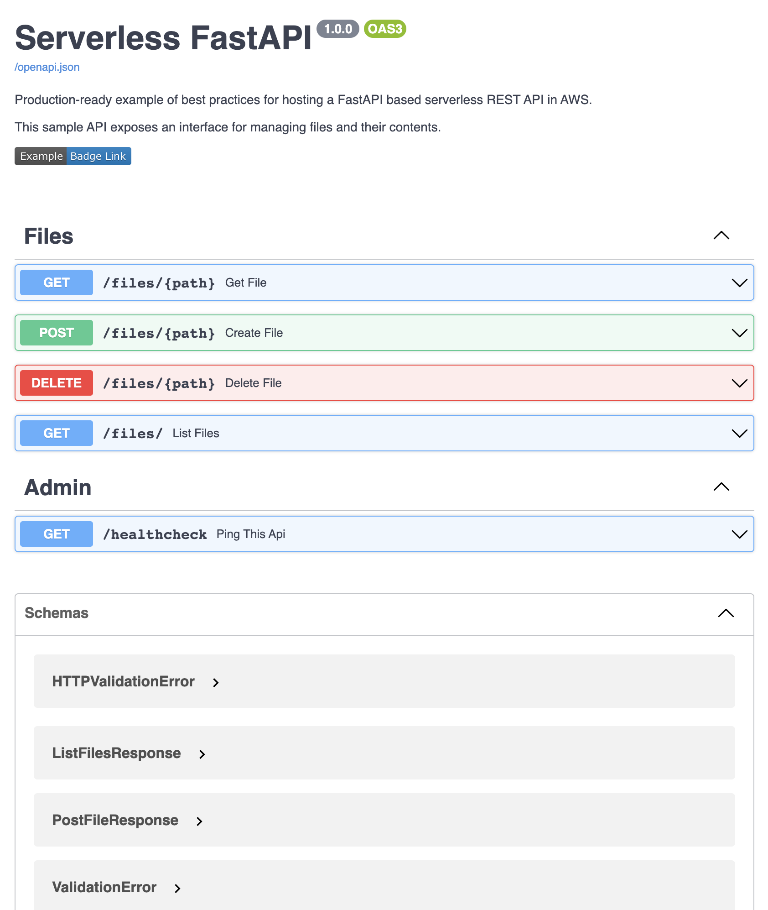

References:

1. AWS-themed GitHub Pages marketing page: https://aws-otel.github.io/
2. AWS Lambda Python setup: https://aws-otel.github.io/docs/getting-started/lambda/lambda-python
3. OpenTelemetry Python autoinstrumentation [PyPI page](https://pypi.org/project/opentelemetry-instrumentation/)
4. [Sample AWS ADOT-instrumented Flask API app](https://github.com/aws-observability/aws-otel-python/tree/main/integration-test-apps/auto-instrumentation/flask)

## Notes

### Course Announcement

Potential name: "Foundations for MLOps on AWS: deploying and managing software in production"


Target audience: people who know Python and would like to learn how to "ship" production software using AWS.


We'll use the free-tier services here to


- write a production-ready REST API with FastAPI

- test the code with unit testing, and the scalability with load testing

- deploy it with infrastructure as code (AWS CDK) as we would in a production setting

- monitor it with logs, traces, metrics, dashboards, and alerts

- update it 

- cheaply start small (with AWS Lambda), cheaply scale up (with Docker containers) 

- continuous integration, continuous delivery, and continuous deployment using GitHub Actions


### AWS Free Tier

Table of these images with labels of AWS services. 2 images in each row.

|                                                       |                                                         |
| ----------------------------------------------------- | ------------------------------------------------------- |
| 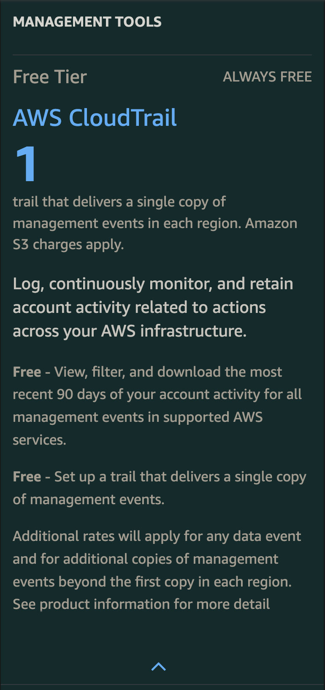 <br/> CloudTrail | 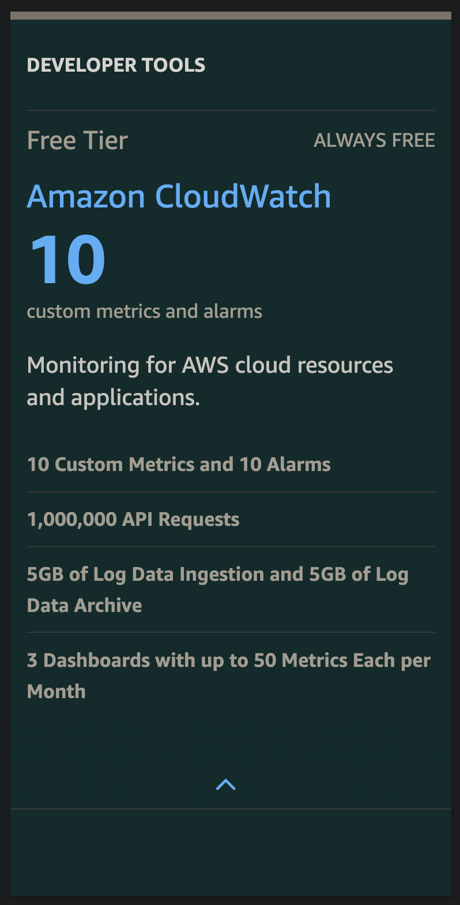 <br/> CloudWatch   |
| 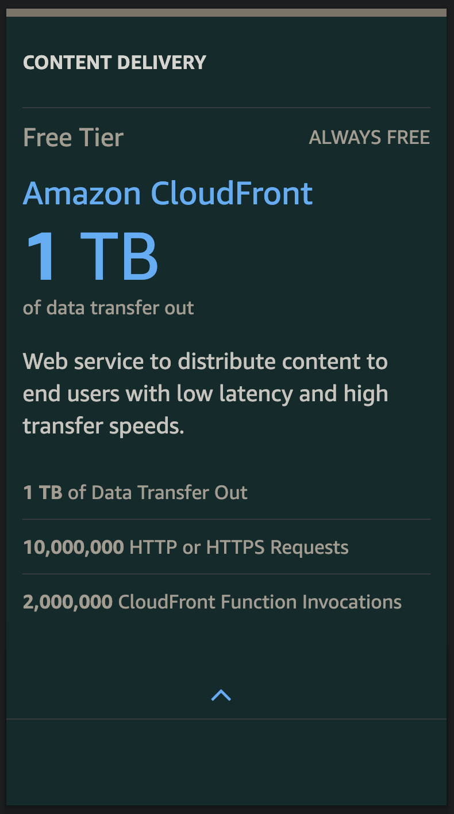 <br/> CloudFront | 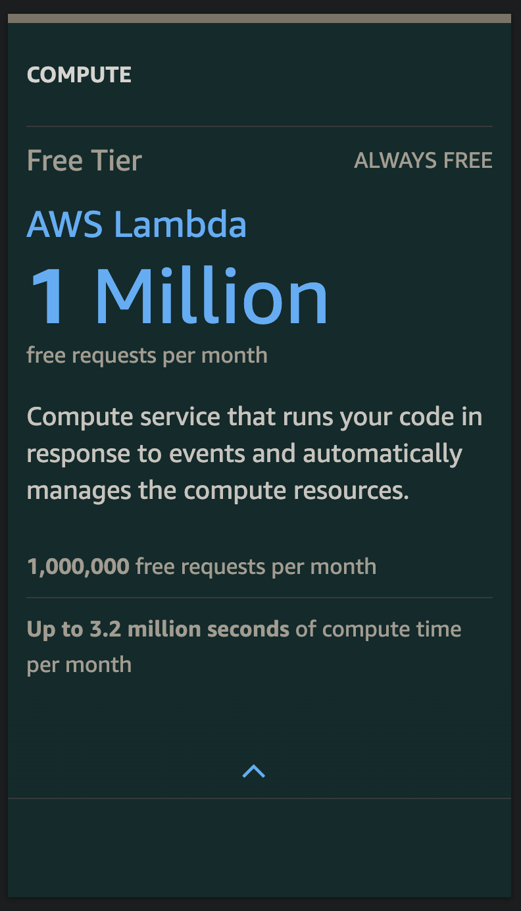 <br/> Lambda           |
| 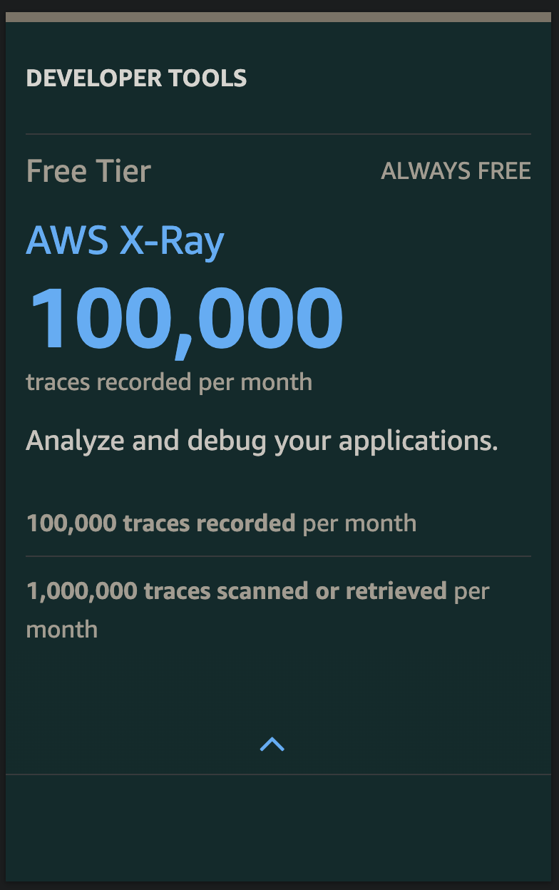 <br/> X-Ray           | 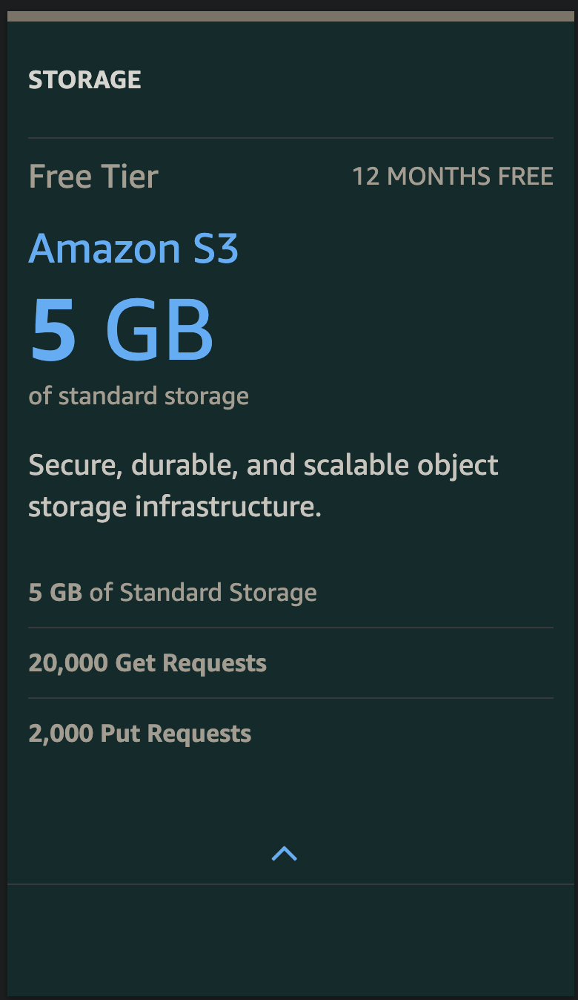 <br/> S3                   |
| 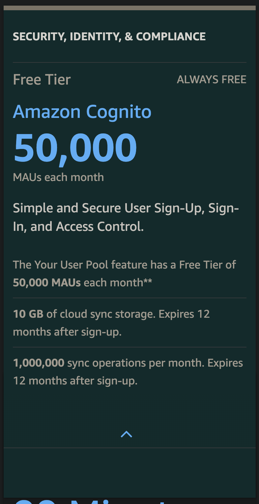 <br/> Cognito       | 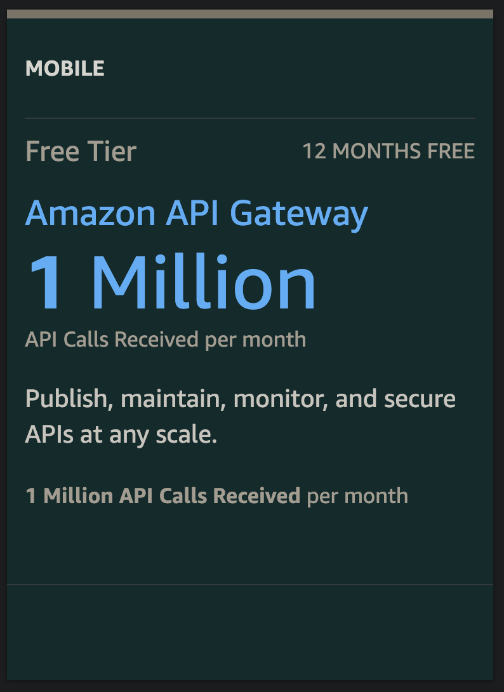 <br/> API Gateway |


### IaC advantages

- Free tier: delete your account and redeploy your whole app in a new one
  - renewed 15-30 day free tier
  - renewed 12-month free tier
- Deploy apps in an identical way: hook up all your REST APIs with monitoring, alerts, cost saving architecture, security, etc.
- Easy consistent tagging strategy, great for tracking costs, which developer created something, which app each resource is part of, etc.
- Automated deploys: continuous deployment
- Complete teardown: save money by cleaning up every resource associated with an entire, complex app
- State management: 10 resources could have (10 choose 0) + (10 choose 1) + ... + (10 choose 10) possible created/not-created states
  not to mention the individual attributes
- Your account doesn't become a mess, especially if you are sharing it with other developers. Story of how BEN's
  `ben-ai-development` account became a production account. Story of Steve deleting his personal S3 bucket which
  turned out to have production data in it by the time he deleted it.
- Abstraction: deploy apps with constructs like `ApplicationLoadBalancedFargateService` and `s3.Bucket(auto_delete=True)`
  which creates a lambda function. Talk about those lambda functions. Quickly create complex infrastructures you would
  otherwise spend weeks designing. Learn cloud architecture years faster than it used to take senior engineers.

### API Gateway

I got these metrics when I set `metrics_enabled=True`.

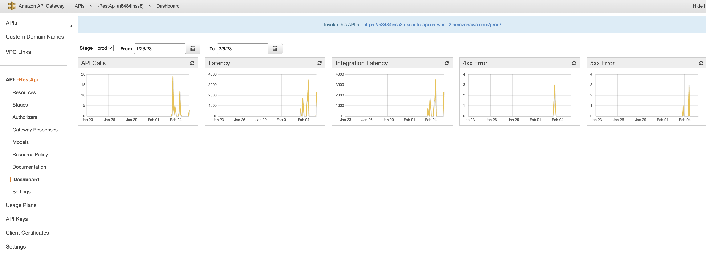

And this when I set `tracing_enabled=True`. Before setting this to `True`, we saw the same visualization, but
the API Gateway component was missing.

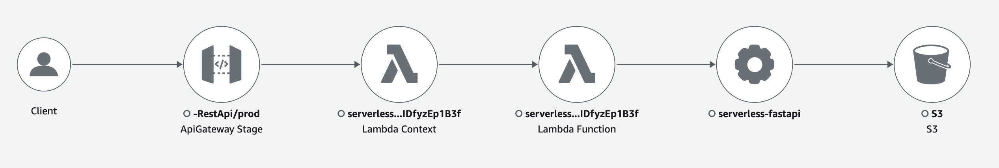

```python
self._api = apigw.RestApi(
    self,
    f"-RestApi",
    deploy_options=apigw.StageOptions(
        stage_name=DEFAULT_STAGE_NAME,
        metrics_enabled=True,
        tracing_enabled=True,
        description="Production stage",
        throttling_burst_limit=10,
        throttling_rate_limit=2,
    ),
    description="Serverless FastAPI",
)
```

### Instrumentation

Good resource:

### `uvicorn` problem

`opentelemetry-instrument -- uvicorn ...` fails to autoinstrument our app.

[This GitHub issue](https://github.com/open-telemetry/opentelemetry-python-contrib/issues/385) says that it's an issue with how uvicorn starts workers. Uvicorn starts new processes. The uvicorn main
process gets instrumented, but the new child processes containing our FastAPI application code don't end up getting
instrumented.

I verified that I could make instrumenting work by adding the autoinstrumentation lines of code for
logging directly in our code files. So manual instrumentation works to an extent with `uvicorn`. To get around
this issue, I switched the `Dockerfile` to use `gunicorn` instead. That fixed the issue.

This should be fine, we use `gunicorn` in production. Also, `gunicorn` won't even be used for production in this case,
as we'll be using AWS Lambda. As long as autoinstrumentation works in AWS Lambda as well, we can be confident that
we can deploy our app in Docker with `gunicorn` or on AWS Lambda with the OTel AWS distro without having to modify
our code.

### Structured logging

AWS likes it when you use `json.dumps()` on python dicts when inserting them in log statements.

You might to a statement like

```python
import json
logger.info("This is a log statement with a jsonified dict %s", json.dumps({"key": "value"}))
```

The key-value pairs in the dict will become structured and searchable via CloudWatch logs.
The builtin AWS log fields are usually `@message` and the others you can see in this screenshot:

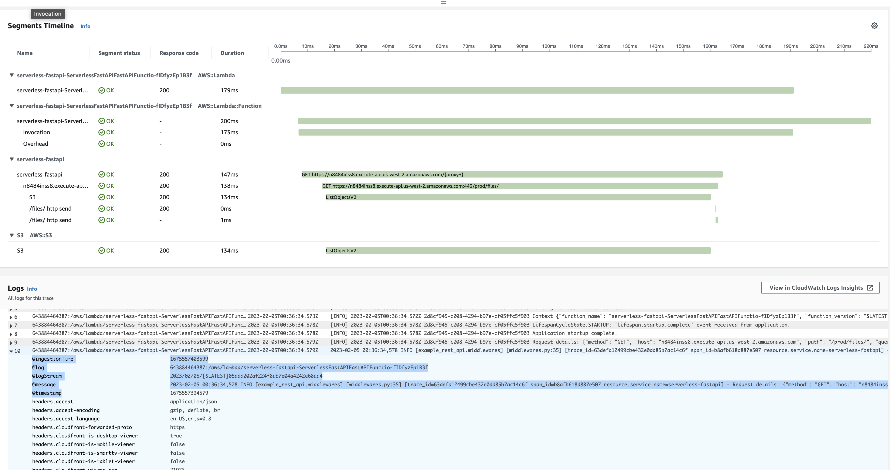

### Custom choices

Any custom choices you make for your app are BAD!

- Logging format
- Generating request ID, what to call that header

You want as many apps in your group/company to use the same standards as possible.

### Course presentation

MLOps is a combination of Software Development, DevOps, ML Engineering, and Data Engineering.

This course will give lots of good exposure to Software Development and DevOps, and attempt
to include ML Engineering examples (like when you need to keep track of RAM, say ways
a ML service could crash due to the problems typical services run into).

Show a heirarchy of needs?

- Code
- Deployment
- Training, re-training, and special deployment steps for MLOps (not covered here)
- Monitoring afterward
- ML-specific Monitoring (not covered here)

Talk about logs, traces, metrics, dashboards, alerts.

### Badges

Could do a quick tangent on https://shields.io/ when we make the FastAPI docs description.

### API Gateway

Example `event` passed from the API Gateway to the lambda:

```python
{
    "resource": "/{proxy+}",
    "path": "/openapi.json",
    "httpMethod": "GET",
    "headers": {
        "Accept": "application/json,*/*",
        "Accept-Encoding": "gzip, deflate, br",
        "Accept-Language": "en-US,en;q=0.8",
        "CloudFront-Forwarded-Proto": "https",
        "CloudFront-Is-Desktop-Viewer": "true",
        "CloudFront-Is-Mobile-Viewer": "false",
        "CloudFront-Is-SmartTV-Viewer": "false",
        "CloudFront-Is-Tablet-Viewer": "false",
        "CloudFront-Viewer-ASN": "21928",
        "CloudFront-Viewer-Country": "US",
        "Host": "n8484inss8.execute-api.us-west-2.amazonaws.com",
        "Referer": "https://n8484inss8.execute-api.us-west-2.amazonaws.com/prod/",
        "sec-fetch-dest": "empty",
        "sec-fetch-mode": "cors",
        "sec-fetch-site": "same-origin",
        "sec-gpc": "1",
        "User-Agent": "Mozilla/5.0 (Macintosh; Intel Mac OS X 10_15_7) AppleWebKit/537.36 (KHTML, like Gecko) Chrome/109.0.0.0 Safari/537.36",
        "Via": "2.0 ec99de6a8df96b4e008b942ab98e6594.cloudfront.net (CloudFront)",
        "X-Amz-Cf-Id": "kQzO9p3DMD3ncxkO4iPqRzen6HhIk8Y-oAUMgnwL06XZ1MLQMkBMWA==",
        "X-Amzn-Trace-Id": "Root=1-63dd9630-1f7ec6c948e660f220ef3c92",
        "X-Forwarded-For": "172.59.153.63, 64.252.130.90",
        "X-Forwarded-Port": "443",
        "X-Forwarded-Proto": "https",
    },
    "multiValueHeaders": {
        "Accept": ["application/json,*/*"],
        "Accept-Encoding": ["gzip, deflate, br"],
        "Accept-Language": ["en-US,en;q=0.8"],
        "CloudFront-Forwarded-Proto": ["https"],
        "CloudFront-Is-Desktop-Viewer": ["true"],
        "CloudFront-Is-Mobile-Viewer": ["false"],
        "CloudFront-Is-SmartTV-Viewer": ["false"],
        "CloudFront-Is-Tablet-Viewer": ["false"],
        "CloudFront-Viewer-ASN": ["21928"],
        "CloudFront-Viewer-Country": ["US"],
        "Host": ["n8484inss8.execute-api.us-west-2.amazonaws.com"],
        "Referer": ["https://n8484inss8.execute-api.us-west-2.amazonaws.com/prod/"],
        "sec-fetch-dest": ["empty"],
        "sec-fetch-mode": ["cors"],
        "sec-fetch-site": ["same-origin"],
        "sec-gpc": ["1"],
        "User-Agent": [
            "Mozilla/5.0 (Macintosh; Intel Mac OS X 10_15_7) AppleWebKit/537.36 (KHTML, like Gecko) Chrome/109.0.0.0 Safari/537.36"
        ],
        "Via": ["2.0 ec99de6a8df96b4e008b942ab98e6594.cloudfront.net (CloudFront)"],
        "X-Amz-Cf-Id": ["kQzO9p3DMD3ncxkO4iPqRzen6HhIk8Y-oAUMgnwL06XZ1MLQMkBMWA=="],
        "X-Amzn-Trace-Id": ["Root=1-63dd9630-1f7ec6c948e660f220ef3c92"],
        "X-Forwarded-For": ["172.59.153.63, 64.252.130.90"],
        "X-Forwarded-Port": ["443"],
        "X-Forwarded-Proto": ["https"],
    },
    "queryStringParameters": None,
    "multiValueQueryStringParameters": None,
    "pathParameters": {"proxy": "openapi.json"},
    "stageVariables": None,
    "requestContext": {
        "resourceId": "rpy2e8",
        "resourcePath": "/{proxy+}",
        "httpMethod": "GET",
        "extendedRequestId": "fyRnmEIvPHcFmIg=",
        "requestTime": "03/Feb/2023:23:18:08 +0000",
        "path": "/prod/openapi.json",
        "accountId": "643884464387",
        "protocol": "HTTP/1.1",
        "stage": "prod",
        "domainPrefix": "n8484inss8",
        "requestTimeEpoch": 1675466288419,
        "requestId": "2bfe1913-eea8-48de-b643-166b53428586",
        "identity": {
            "cognitoIdentityPoolId": None,
            "accountId": None,
            "cognitoIdentityId": None,
            "caller": None,
            "sourceIp": "172.59.153.63",
            "principalOrgId": None,
            "accessKey": None,
            "cognitoAuthenticationType": None,
            "cognitoAuthenticationProvider": None,
            "userArn": None,
            "userAgent": "Mozilla/5.0 (Macintosh; Intel Mac OS X 10_15_7) AppleWebKit/537.36 (KHTML, like Gecko) Chrome/109.0.0.0 Safari/537.36",
            "user": None,
        },
        "domainName": "n8484inss8.execute-api.us-west-2.amazonaws.com",
        "apiId": "n8484inss8",
    },
    "body": None,
    "isBase64Encoded": False,
}

```